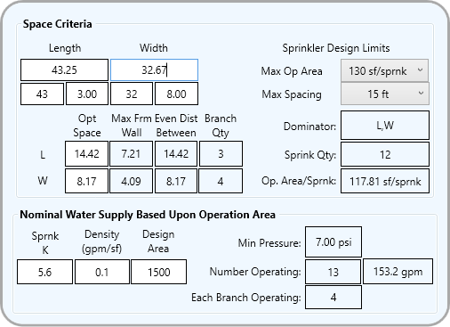

# aksSprinkSpacerCS     

### General

- A simple tool for determining the optimum automatic fire sprinkler spacing for a space which in turn is used to plan an NFPA 13 design layout.
- The tool is useful for someone familiar with the decisions necessary to layout automatic fire sprinklers in a space given a set of sprinkler design criteria limits.
- The tool also figures the ***nominal*** water supply demand that applies to specific design criteria. The supply demand is useful for quickly noticing the relative difference in demand between design layout choices. The ***nominal*** water supply demand is not the actual water supply demand and should not be interpreted as such.

### Brief Explanation How It Might Be Used

- Length and Width are the space dimensions from wall to wall. The upper boxes are numbers in decimal feet. The two boxes below the Length and Width are where feet and inches may be entered.
   - For example if the room length is 43'-3" then enter the 43 in the foot box and 3 in the inches box. Any entered inches number larger than or equal to 12 will be accepted.
- The **Opt Space** fields are the calculated optimum sprinkler spacing in the direction indicated. The optimum spacing is what results in the least number of sprinklers in that direction using the selections the in **Max Op Area** and **Max Spacing** pulldown comboboxes.
- The **Dominator** box indicates which dimension, if it does, drives the optimum spacing. There are some space and sprinkler design limits where there is only one optimum solution spacing X by Y where a spacing layout Y by X actually requires more sprinklers.
- In the image shown the optimum spacing is 14.42 x 10.89. If this space has a 2 foot module ceiling tile layout that requires the sprinklers to be spaced in 2 foot increments then the layout design has to be 14 feet in the L direction to meet the design limits selections.
- For the image shown if the space is going to have upright sprinklers the **Max Frm Wall** and the **Even Dist Between** numbers are used for making free air sprinkler location placement decisions.

### To Do

This application goes back 15 years or more to an Autodesk AutoCAD VBA version that is used in combination with a graphic layout template that the application could synchronize with the tool. The graphic layout provides a snapping grid for placing sprinklers and allows the layout to be visualized with the AutoCAD space graphics. In AutoCAD this implementation is essentially instantaneous and therefore the tool has benefits.

The To Do for this application is to provide a similar device in an AutoDesk Revit application. Unfortunately the awkward and sluggish UI for Revit, plus its additional complications associated with the Revit model schemes, severely dampens the incentive for pursuing a solution.    
